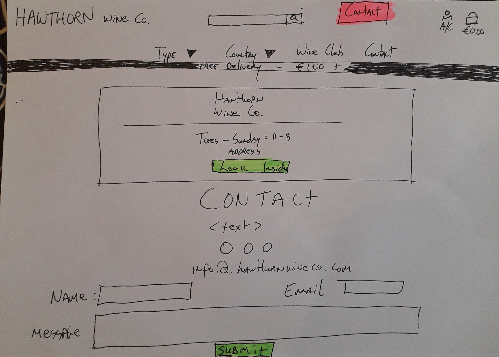

## Introduction

Milestone Project 4: Full-Stack Frameworks with Django - Code Institute

The Hawthorn Wine Co. is a Full-Stack webpage for a Wine Company opening in early 2021.
The main purpose is to offer an online store selling imported wines.
The site will also function to build the brand's identity and to incorporate the business owners desired colour schemes, logos, fonts etc. as well as links to their social media.
My main purpose when creating the webpage was to ensure that the site provided a pleasant and uncomplicated user experience allowing the user to access the appropriate information and make a purchase hassle free.

Click the link below to run my project in the live environment:

[Hawthorn Wine Co.](https://hawthorn-wine-co.herokuapp.com/)

<!-- # Table of contents
1. [Introduction](#introduction) -->

## Table of Contents
1. [UX](#ux)
2. [Goals](#goals)
     * [User Goals](#user-goals)
     * [Site Owner Goals](#business-goals)
*  [User Stories](#user-stories)
*  [Wireframes](#wireframes)
*  [Design Choices](#design-choices)
    + [Color Choice](#color-choice)
    + [Typography](#typography)
      - [Title Font](#title-font)
      - [Base Font](#base-font)
    + [Image Choice](#image-choice)
      - [Service Levels](#service-levels)
    + [Design Elements](#design-elements)
6. [Features](#features)
  * [Implemented Features](#implemente
7. [Technologies Used](#technologies-used)
  * [Programming Languages](#programming-languages)
  * [Framework & Extensions](#framework--extensions)
  * [Fonts](#fonts)
  * [Tools](#tools)
  * [APIs](#apis)
8. [Defensive Programming](#defensive-programming)
  * [Additional Security Checks](#additional-security-checks)
  * [Custom Validation](#custom-validation)
9. [Testing](#testing)
10. [Deployment](#deployment)
  * [Requirements](#requirements)
  * [Local](#local)
  * [Heroku](#heroku)
11. [Credits](#credits)
>  * [Content](#content)
>  * [Media](#media)
>  * [Acknowledgements](#acknowledgements)
>    

### Project Purpose 

  **Build a website for a Wine Store**

1. External user’s goal:
   -Find wines to purchase
   -Register for an account

2. Site owner's goal:
   -Sell Wines
   -Build brand aesthetic
   -Create a database of customers


## User Experience (UX)

-   ### User stories

    -   #### Viewing and Navigation

        1. As a Shopper, I want to be able to easily be able to navigate throughout the site to find wines and then select for purchase.
        2. As a Shopper, I want to be able to view individual wine details so that I can identify the price, description, and all necessary details.
        3. As a Shopper, I want to easily view the total of my purchases at any time so as to avoid spending too much.

    -   #### Registration and User Accounts

        4. As a Site User, I want to easily register for a personal account and be able to view my profile.
        5. As a Site User, I want to easily login or logout to access my personla information.
        6. As a Site User, I want to be able to recover my password if forgotten to regain access to my account.
        7. As a Site User, I want to be able to recover my password if forgotten to regain access to my account.
        8. As a Site User, I want to receive an email confirmation agter registering and to verify that my account registration was sucessful.
        8. As a Site User, I want to be have a personalised user profile to that I can view my personal order history and save payment information.

     -   #### Sorting and Searching
      9. As a Shopper, I want to be able to easily sort the list of available wines by type, price, country etc.
      10. As a Shopper, I want to be able to search for a product by name or description and find a specific product I would like to purchase.
      11. As a Shopper, I want to be able to easily see what I've searched for and the number of results so I can quickly see if the product is available.


     -   #### Purchasing and Checkout
     12. As a Shopper, I want to easily select the quantity of a product when I select it.


-   ### Design
    -   #### Colour Scheme
        -   The three main colours used throughout the site are black, white and Seashell Peach.
        -   The site's colour scheme and styling was based on the Owner's request that the site have an independent feel to reflect the business type. 
    -   #### Typography
            I picked an artistic style font giving a hand-drawn feel for the Main-Logo.
        -   Clean, modern type for heading and text. 
    -   #### Imagery
        -   The main image for the site is a large,background hero image with an "OPEN" sign.  As this is a brand new business I thought this was an appropriate choice
        -   The Company Name and also their "Hawthorn Tree" SVG logo also features thorughout the site. 

*   ### Wireframes
    -   I drew the Wireframes for this project as I find drawing them allows for more detailed notes as well as being a more efficient  use of time.

    -   Home Page Wireframe - [View](https://github.com/jmurrii/hawthorn_wine_co/tree/master/documentation/images/homepage-wireframe.jpg)

    
    - Mobile-Wireframe
    

    -   Mobile Wireframe - [View](https://github.com/jmurrii/hawthorn_wine_co/tree/master/documentation/images/mobile-wireframe.jpg)

    -   Products Page Wireframe - [View](https://github.com/jmurrii/hawthorn_wine_co/tree/master/documentation/images/products-wireframe.jpg)

    -   Browse Page Wireframe - [View](https://github.com/jmurrii/hawthorn_wine_co/tree/master/documentation/images/contact-wireframe.jpg)

## Features

-   Responsive on all device sizes.

-   Submit, Edit and Delete operations to manage book recommendations.

-   About page with link to article which inspired the project plus clear instructions on how to proceed.

### Future Features 

 # Login System
- A User Login System would open up the possibility of users being able to login and edit their uploads securely.

 # Chart System
- When enough users have submitted books to the site I would like to implement a chart system recording the most popular books. This     would enhance the user experience and make the site more useful.

 # Upload Image with Book Submissions
- Providing the possibility to upload an image/link to the book cover would make the site more visually appealing.


## Technologies Used

### Design
    Photoshop, Logomakr, GoogleFonts, FontAwesome

### Front-End

- [HTML](https://en.wikipedia.org/wiki/HTML5) Used for storing all my pages.
- [CSS](https://no.wikipedia.org/wiki/Cascading_Style_Sheets) Used for the styling of my webpage.
- [Javascript](https://no.wikipedia.org/wiki/JavaScript) Used for initializing my buttons and some functions for my payment  methods(Stripe API).
- [Stripe](https://stripe.com/en-no) Used for accepting payments.
- [Bootstrap](https://getbootstrap.com/docs/4.4/) Used for styling of the webpage.
- [Font-Awesome-Icons](https://fontawesome.com/icons?d=gallery&m=free) used for styling my navigation bar and some other         sections.
- [Jquery](https://en.wikipedia.org/wiki/JQuery) Used for manipulating the dom and for the Stripe API development.

### Back-End

- [Django](https://docs.djangoproject.com/en/3.0/releases/1.11/) For all the functionality and all my coding.
- [Git](https://en.wikipedia.org/wiki/Git) Used for writing commands and inserting new documents in my webpage
- [Github](https://github.com/) Used to store my webpage for the users to have access and for my tutors and mentor to help me with my Milestone Project.
- [PostgreSQL](https://www.postgresql.org/)Used for deployment in Heroku.
- [Gunicorn](https://docs.gunicorn.org/en/stable/) Used as the Http server.
- [Heroku](https://en.wikipedia.org/wiki/Heroku) Used for the deployment of my project.


## Testing


### Code Validation

- I used the [W3C HTML Validator tool](https://validator.w3.org/#validate_by_input) to validate my HTML code.
- I used the [W3C CSS Validator tool](https://jigsaw.w3.org/css-validator/#validate_by_input) to validate my CSS code.
- I used the [Pep8 Online tool](http://pep8online.com/) to validate my Python syntax.
- [view](https://github.com/jmurrii/MS3/blob/master/documentation/PEP8%20Validation.png)

### Testing User Stories from User Experience (UX) Section

-   ### User stories

    -   #### Viewing and Navigation

        1. As a Shopper, I want to be able to easily be able to navigate throughout the site to find wines and then select for purchase.
        - The site has a clearly visible navebar where users can search by Wine type or by Country.
        There is also a Search bar above the Navbar where User's can search by Name, Category, Country, Descroption etc.


        2. As a Shopper, I want to be able to view individual wine details so that I can identify the price, description, and all necessary details.
        - Each Wine has it's own Product Details page where the user can find all necessary information on the wine.

        3. As a Shopper, I want to easily view the total of my purchases at any time so as to avoid spending too much.
        - The site provides a cart icon in the top right corner which updates as the user adds items.  This makes it easy at all times to view the proposed cost of the shopping cart.

    -   #### Registration and User Accounts

        4. As a Site User, I want to easily register for a personal account and be able to view my profile.
        -  The site provides a registration option which is clearly visible on all pages in the site.
        This allows user to create a personal account and access transaction history.
        
        5. As a Site User, I want to easily login or logout to access my personal information.
        - Login/Logout functionality is available from the header section on every page.

        6. As a Site User, I want to be able to recover my password if forgotten to regain access to my account.
        -  The "Forgot Password?" link underneath the login option provides the opportunity for the user to reset their password on providing the appropriate email address.
        
        7. As a Site User, I want to receive an email confirmation after registering and to verify that my account registration was sucessful.
        - Users receive an email to confirm successful registration and also a link to confirm their account.
       
        8. As a Site User, I want to be have a personalised user profile to that I can view my personal order history and save payment information.
        - Users have the ability to create their own account which stores their personal order history and saves information.

     -   #### Sorting and Searching
      9. As a Shopper, I want to be able to easily sort the list of available wines by type, price, country etc.
      - The site provides the ability to search by type, country, and by price(ascending or descending.)

      10. As a Shopper, I want to be able to search for a product by name or description and find a specific product I would like to purchase.
      - The site's Searchbar allows the user to search by name or description enhancing the user experience.

      11. As a Shopper, I want to be able to easily see what I've searched for and the number of results so I can quickly see if the product is available.
      - The number of items searched for and name of category is returned at the top of the page.


     -   #### Purchasing and Checkout
     12. As a Shopper, I want to easily select the quantity of a product when I select it.
     - The shopping bag and product pages make it easy to choose product quantity.

     13. As a Shopper, I want to view items to be purchased in my bag.
     -  The total cost of all items in shopping bag is easily viewable at the top of the page across the site.

     14. As a Shopper, I want to be able to adjust the quantity of individual items in my bag.
     - At the checkout page there is an option to increase or delete products making it easier for the customer to make changes to their order.

     15. As a Shopper, I want to be able to easily enter my payment information.
     - The checkout page makes payment a very straightforward and easy process for the customer with all relevant information clear and with prompts and easy to follow instructions.
     There is also the option to store payment information making repeat transactions hassle-free.

     16. As a Shopper, I want to feel my personal information is safe and secure.
     - Payment is handled via Stripe which is a globally recognised and secure payment system ensuring the user can be confident with their transaction.

     17. As a Shopper, I want to be able to view an order confirmation after checkout.
     - Users will see an order confirmation view after completing their order.

     18. As a Shopper, I want to receive an email confirmation after checking out.
     - Customers receive an email comfirming their order after payment had been processed.
     

-   #### Admin and Site Management Goals
        
    1. As a site owner I want to be able to add new items to my store.
    - The Admin page allows new products to be added to product database.
   
    2. As a site owner I want to be able to edit-update products.
    - The Admin page allows editing and updating of all relevant fields for all products.

    3. As a site owner I want to be able to delete products. 
    - The Admin page allows removal of products no longer available.
 

### Further Testing

-   The Website was tested on Google Chrome, Internet Explorer, Microsoft Edge and Safari browsers.
-   The website was viewed on a variety of devices such as Desktop, Laptop, iPhone7, iPhone 8 & iPhoneX.
-   A large amount of testing was done to ensure that all pages were linking correctly.
-   Friends and family members were asked to review the site to point out any bugs and/or user experience issues.

### Known Bugs

-   .

## Deployment

I used GitHub for my version control and Heroku to host the live version of my project. 


To deploy my website to Heroku, I used the following steps:

1. Created the app in Heroku.
2. Run the `snap install --classic heroku` command in the terminal window to instal heroku in my local workspace.
3. Ran the `heroku login -i` command in the terminal window and entered my credentials to login to Heroku.
4. Added and committed the files to Git.
5. Linked the Heroku app as the remote master branch.
6. Created a requirements.txt file.
7. Created a Procfile
8. Ran the `git push heroku master` command in the terminal window to push the app to Heroku.
9. Ran the `heroku ps:scale web=1` command in the terminal window to run the app in Heroku.
10. Entered the following Config Var in Heroku:

    ```MONGO_URI : <link to MongoDB>```


The app was successfully deployed to Heroku at this stage.

### Live App Link

Click the link below to run my project in the live environment:

[Hawthorn Wine Co.](https://hawthorn-wine-co.herokuapp.com/)


### Forking the GitHub Repository

#### Note:
- For Secret Key contact me @ jonmurrii@gmail.com

By forking the GitHub Repository we make a copy of the original repository on our GitHub account to view and/or make changes without affecting the original repository by using the following steps...

1. Log in to GitHub and locate the [GitHub Repository](https://github.com/)
2. At the top of the Repository (not top of page) just above the "Settings" Button on the menu, locate the "Fork" Button.
3. You should now have a copy of the original repository in your GitHub account.

### Making a Local Clone

1. Log in to GitHub and locate the [GitHub Repository](https://github.com/)
2. Under the repository name, click "Clone or download".
3. To clone the repository using HTTPS, under "Clone with HTTPS", copy the link.
4. Open Git Bash
5. Change the current working directory to the location where you want the cloned directory to be made.
6. Type `git clone`, and then paste the URL you copied in Step 3.

```
$ git clone https://github.com/YOUR-USERNAME/YOUR-REPOSITORY
```

7. Press Enter. Your local clone will be created.

```
$ git clone https://github.com/YOUR-USERNAME/YOUR-REPOSITORY
> Cloning into `CI-Clone`...
> remote: Counting objects: 10, done.
> remote: Compressing objects: 100% (8/8), done.
> remove: Total 10 (delta 1), reused 10 (delta 1)
> Unpacking objects: 100% (10/10), done.
```

Click [Here](https://help.github.com/en/github/creating-cloning-and-archiving-repositories/cloning-a-repository#cloning-a-repository-to-github-desktop) to retrieve pictures for some of the buttons and more detailed explanations of the above process.

## Credits

### Code

-   
-   [Bootstrap4](https://getbootstrap.com/docs/4.4/getting-started/introduction/): Bootstrap Library used throughout the project mainly to make site responsive using the Bootstrap Grid System.


### Content

-   All content was written by the developer.

-   Format of README.md followed *[this](https://github.com/Code-Institute-Solutions/SampleREADME#code-institute-website)*    example.

-   I took much inspiration and guidance from the Code Institute's Boutique Ado E-Commerce video series [Code Institute](https://codeinstitute.net/)

-  I also took inspiration from the following online Wine Stores 
    
    [Rebel Wines](https://www.rebelwines.nl/us/)
    [Grape&Grind](https://grapeandgrind.co.uk/)
    [Vinello](https://www.vinello.eu/)
    [Volatil](https://volatil.dk/)
    [WineOnline.ie](https://wineonline.ie/)


### Media

-   All Images used in the site were taken from [Pexels](https://www.pexels.com/).

-   Favicon created at [Logomakr](https://logomakr.com/).

### Acknowledgements

-   My Mentor Anto Rodriguez for his invaluable help throughout the project.

-   Tutor support at Code Institute for their support.
